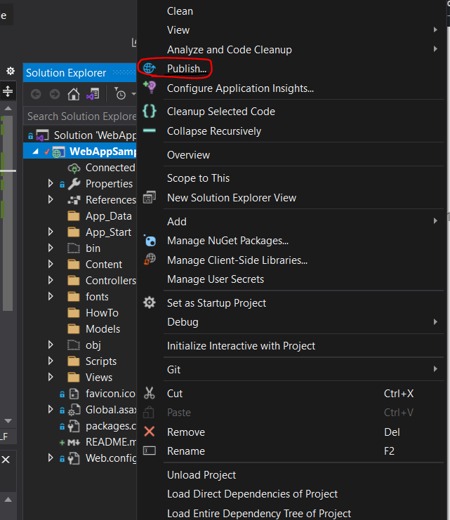
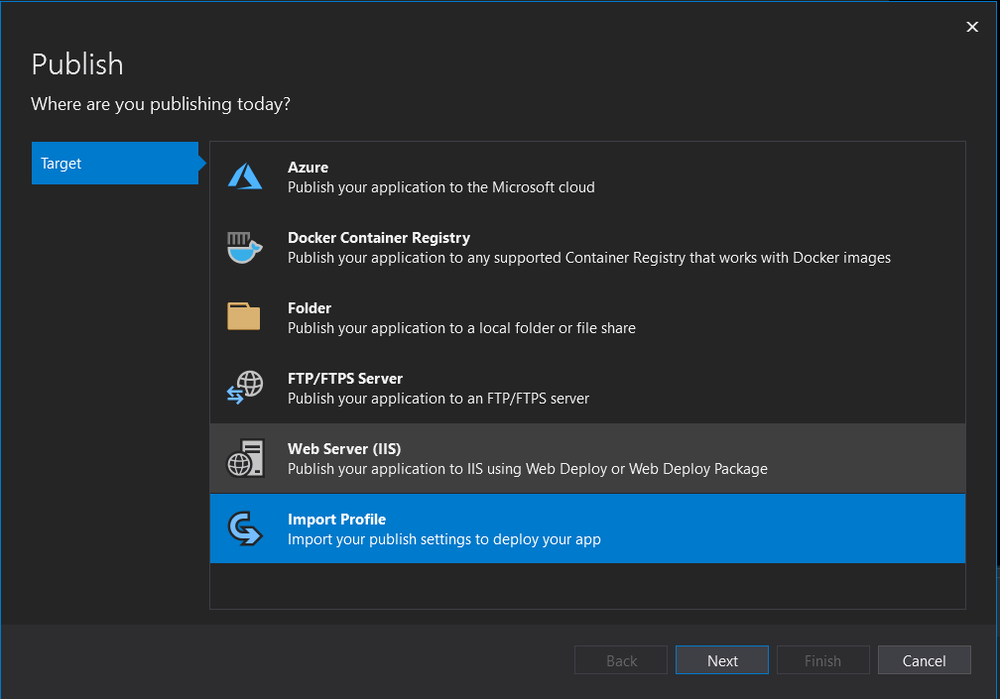
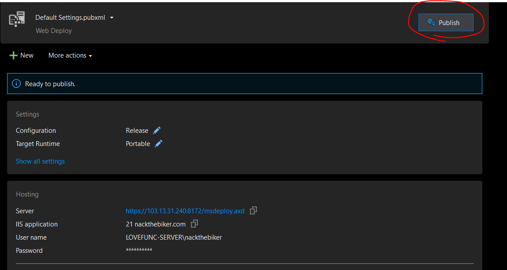

# Set Hosts file

## Open Hosts file as Administrator

c:\Windows\System32\Drivers\etc\hosts

add "103.13.31.240 nackthebiker.com" and save file

## open command prompt (CMD)

run "ipconfig /flushdns"

#How to deploy

Right click Project Select Public

Select Import profile

Click Publish Then put your Password

